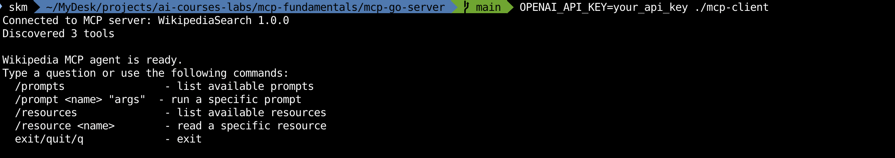
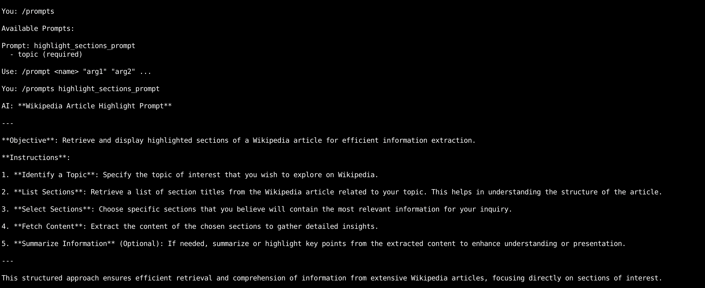
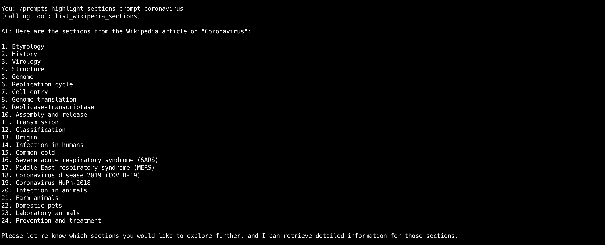
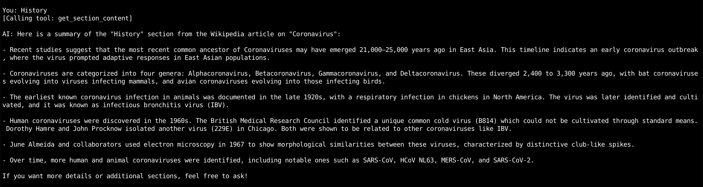

# WikipediaSearch MCP Server (Go)

A Go implementation of the WikipediaSearch MCP server that exposes Wikipedia search capabilities over stdio transport.

## Prerequisites

- Go 1.25+
- `OPENAI_API_KEY` environment variable (required by the interactive client)

## Project Structure

```
mcp-go-server/
  main.go                 # MCP server entry point
  wikipedia/client.go     # Wikipedia API wrapper
  cmd/client/main.go      # Interactive MCP client (agentic loop)
  suggested_titles.txt    # Sample resource data
```

## Build

```bash
cd mcp-go-server
go build -o mcp-wikipedia-server .
go build -o mcp-client ./cmd/client
```

## Components

| Type     | Name                       | Description                                       |
|----------|----------------------------|---------------------------------------------------|
| Tool     | `fetch_wikipedia_info`     | Search Wikipedia and return title, summary, URL   |
| Tool     | `list_wikipedia_sections`  | List section headings of a Wikipedia article      |
| Tool     | `get_section_content`      | Get content of a specific section                 |
| Prompt   | `highlight_sections_prompt`| Pick the most important sections from an article  |
| Resource | `file://suggested_titles`  | Suggested Wikipedia topics from a local file      |

## Interactive Client

The project includes a Go MCP client that connects to the server via stdio, discovers available tools, and runs an agentic loop using OpenAI GPT-4o. When you type a question, the client sends it to GPT-4o which autonomously decides which MCP tools to call, processes the results, and returns a final answer.

### Run

```bash
OPENAI_API_KEY=<API_KEY> ./mcp-client
```

The client expects the `mcp-wikipedia-server` binary in the current directory.

### REPL Commands

| Command                    | Description                          |
|----------------------------|--------------------------------------|
| `/prompts`                 | List available MCP prompts           |
| `/prompt <name> "args"`   | Run a specific prompt via the agent  |
| `/resources`               | List available MCP resources         |
| `/resource <name>`         | Read a specific resource             |
| `exit` / `quit` / `q`     | Exit the client                      |

Any other input is sent as a question to the GPT-4o agent loop.

### Interactive Test Run






## Run (Server)

The server communicates over stdio (stdin/stdout) using JSON-RPC, so it's meant to be launched by an MCP client. The interactive client above does this automatically, or you can point any MCP-compatible client at the binary:

```bash
./mcp-wikipedia-server
```

## Test manually

Each command below sends an `initialize` handshake followed by a request.

**List tools:**

```bash
printf '{"jsonrpc":"2.0","id":0,"method":"initialize","params":{"protocolVersion":"2024-11-05","capabilities":{},"clientInfo":{"name":"test","version":"1.0"}}}\n{"jsonrpc":"2.0","id":1,"method":"tools/list"}\n' | ./mcp-wikipedia-server
```

**Call a tool:**

```bash
printf '{"jsonrpc":"2.0","id":0,"method":"initialize","params":{"protocolVersion":"2024-11-05","capabilities":{},"clientInfo":{"name":"test","version":"1.0"}}}\n{"jsonrpc":"2.0","id":2,"method":"tools/call","params":{"name":"fetch_wikipedia_info","arguments":{"query":"golang"}}}\n' | ./mcp-wikipedia-server
```

**List prompts:**

```bash
printf '{"jsonrpc":"2.0","id":0,"method":"initialize","params":{"protocolVersion":"2024-11-05","capabilities":{},"clientInfo":{"name":"test","version":"1.0"}}}\n{"jsonrpc":"2.0","id":3,"method":"prompts/list"}\n' | ./mcp-wikipedia-server
```

**Read a resource:**

```bash
printf '{"jsonrpc":"2.0","id":0,"method":"initialize","params":{"protocolVersion":"2024-11-05","capabilities":{},"clientInfo":{"name":"test","version":"1.0"}}}\n{"jsonrpc":"2.0","id":4,"method":"resources/read","params":{"uri":"file://suggested_titles"}}\n' | ./mcp-wikipedia-server
```

## How Stdio Transport Works

If you're new to MCP, you might wonder: how does the client talk to the server without starting it in a separate terminal?

MCP supports a **stdio transport** where the client spawns the server as a child process and communicates over OS pipes — no network sockets involved.

**Server side** (`main.go`): calls `server.ServeStdio(s)`, which reads JSON-RPC requests from its own **stdin** and writes responses to its own **stdout**.

**Client side** (`cmd/client/main.go`): calls `client.NewStdioMCPClient("./mcp-wikipedia-server", nil)`, which under the hood:

1. Spawns `./mcp-wikipedia-server` as a child process (via `os/exec`)
2. Connects a pipe to the child's stdin (for sending requests) and stdout (for reading responses)
3. Returns an `mcpClient` that serializes every method call (`Initialize`, `ListTools`, `CallTool`, ...) as a JSON-RPC message over those pipes

```
┌──────────────────────────────┐
│  mcp-client (parent)         │
│                              │
│  Writes JSON-RPC ────────────────┐
│  Reads  JSON-RPC ◄─────────────┐ │
└──────────────────────────────┘ │ │
                                 │ │
┌──────────────────────────────┐ │ │
│  mcp-wikipedia-server(child) │ │ │
│                              │ │ │
│  server.ServeStdio(s)        │ │ │
│    stdin  ◄──────────────────────┘
│    stdout ─────────────────────┘
└──────────────────────────────┘
```

This is the same mechanism used by Claude Desktop, VS Code extensions, and other MCP hosts. It's simple, secure (no network surface), and requires zero configuration.
